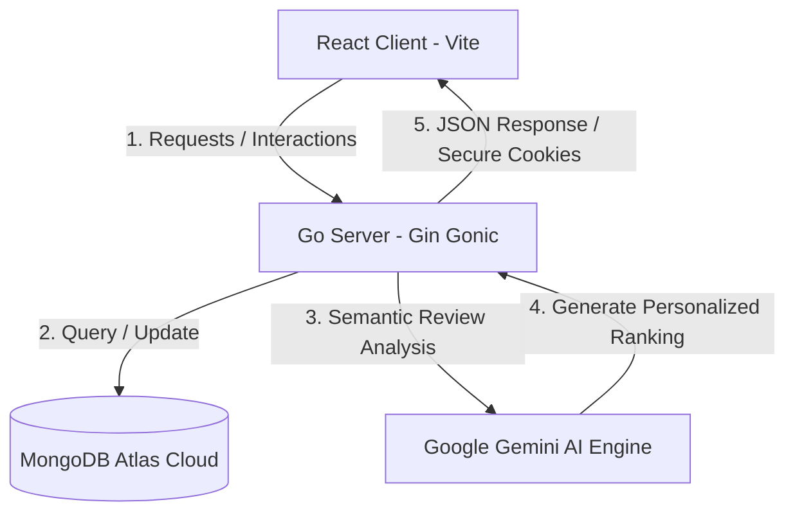

# MagicStream 🎬✨
[](https://react.dev/)
[](https://go.dev/)
[](https://www.mongodb.com/)
[](https://deepmind.google/technologies/gemini/)

MagicStream is a premium, full-stack, production-ready **Movie Streaming & AI Recommendation Platform**. Built with a high-performance **Go (Gin)** backend, a modern glassmorphic **React (Vite)** frontend, and integrated with **Google Gemini AI** for personalized reviews, it represents a state-of-the-art implementation of scalable full-stack architecture.

---

## 🏗️ System Architecture & Data Flow



---

## 🧠 Architectural Breakdown (Under the Hood)

### 1. High-Performance Backend (Go & Gin)
Go is chosen as the server language due to its lightweight runtime, extremely fast startup times, and low memory footprint, which makes it perfect for media-heavy streaming API platforms.
*   **Clean Controller Factory Pattern:** Handlers are designed as closures (e.g. `GetMovies(client *mongo.Client) gin.HandlerFunc`) ensuring database client instances are safely injected without polluting global scopes.
*   **Secure Authentication Flow:** 
    *   Implements secure **JSON Web Tokens (JWT)** for access controls, combined with **Refresh Tokens** stored inside HTTP-Only Cookies to completely prevent Cross-Site Scripting (XSS) token theft.
    *   Custom JWT middleware validates incoming tokens and automatically maps payload parameters like `userID` and `role` to the request contexts.
*   **Google Gemini AI Engine:** Migrated from standard OpenAI APIs to Google Gemini AI. The backend utilizes LLMs to synthetically score, extract sentiment, and dynamically generate personalized rankings based on user movie reviews.
*   **Cloud MongoDB Atlas Integration:** Uses the official MongoDB Go driver to establish lightweight, concurrent connection pools. Uses structured aggregation queries to fetch user watchlists and movies.
*   **Deployment Safety:** Fully compliant with cloud environments (e.g. Render, Railway) via dynamic `PORT` binding and fully masked database connection logs to prevent credential leakage.

### 2. Premium UX/UI Client (React & Vite)
The client-side architecture leverages modern, glassmorphic layout rules and premium micro-interactions to create a cinematic user experience.
*   **Dynamic Theme System (Dark / Light Mode):** Implemented using custom `ThemeContext` and CSS variables. Switching modes dynamically updates gradients, text readability, borders, and frosted-glass panels.
*   **Netflix-Style Horizontal Scroll Carousels:** A custom-engineered `MovieCarousel` component that automatically aggregates, filters, and groups fetched backend databases by their `Genre` into horizontally scrollable tracks equipped with smooth-scrolling physics and hover-triggered navigation controls.
*   **Frosted Glass Skeleton Loading States:** The application avoids generic loading circles. Instead, custom `MovieSkeleton` shimmer layouts are displayed while data is in-flight, creating a faster perceived load time.
*   **Silent JWT Refreshing (Axios Interceptors):** Utilizes custom Axios Private hooks with double request-response interceptors. When a 401 Unauthorized error is detected (due to an expired access token), the client silently requests a token refresh endpoint in the background, retries the initial request, and updates the user's session without interrupting their browsing flow.
*   **Optimistic UI Synchronization:** The watchlist features optimistic updates—instantly rendering changes (e.g., adding or removing a movie) on the user's screen before the backend MongoDB synchronization resolves, providing a completely latency-free feel.

---

## 🗄️ Database Schemas & Data Model

The application interfaces with **MongoDB Atlas** using strongly typed Go models.

#### User Schema
```go
type User struct {
	ID              bson.ObjectID `json:"_id,omitempty" bson:"_id,omitempty"`
	UserID          string        `json:"user_id" bson:"user_id"`
	FirstName       string        `json:"first_name" bson:"first_name" validate:"required,min=2,max=100"`
	LastName        string        `json:"last_name" bson:"last_name" validate:"required,min=2,max=100"`
	Email           string        `json:"email" bson:"email" validate:"required,email"`
	Password        string        `json:"password" bson:"password" validate:"required,min=6"`
	Role            string        `json:"role" bson:"role" validate:"oneof=ADMIN USER"`
	CreatedAt       time.Time     `json:"created_at" bson:"created_at"`
	UpdatedAt       time.Time     `json:"update_at" bson:"update_at"`
	Token           string        `json:"token" bson:"token"`
	RefreshToken    string        `json:"refresh_token" bson:"refresh_token"`
	FavouriteGenres []Genre       `json:"favourite_genres" bson:"favourite_genres"`
	Watchlist       []string      `json:"watchlist" bson:"watchlist"` // Array of IMDB IDs synced with the backend
}
```

#### Movie Schema
```go
type Movie struct {
	ID          bson.ObjectID `json:"_id,omitempty" bson:"_id,omitempty"`
	ImdbId      string        `json:"imdb_id" bson:"imdb_id"`
	Title       string        `json:"title" bson:"title"`
	ReleaseDate string        `json:"release_date" bson:"release_date"`
	PosterPath  string        `json:"poster_path" bson:"poster_path"`
	YoutubeLink string        `json:"youtube_link" bson:"youtube_link"`
	Genre       []Genre       `json:"genre" bson:"genre"`
	Ranking     Ranking       `json:"ranking" bson:"ranking"`
	AdminReview string        `json:"admin_review" bson:"admin_review"`
}
```

---

## 🎯 High-Value Interview Talking Points

1.  **"How did you secure your application's authentication flow?"**
    *   *Answer:* "I implemented a double-token (Access + Refresh Token) standard. The Access Token is stored client-side for immediate API routing, but the highly sensitive Refresh Token is kept inside an HTTP-Only, Secure, and SameSite cookie. This isolates it from the browser's JavaScript environment, rendering the application entirely immune to common Cross-Site Scripting (XSS) token retrieval attacks. I then wrote an Axios private interceptor in React that seamlessly intercepts expired 401 codes to refresh credentials in the background."
2.  **"Why did you choose Go for a streaming backend over Node.js or Python?"**
    *   *Answer:* "Go's native concurrency model (goroutines) and direct compilation to machine code give it incredible performance advantages. It processes HTTP requests on lightweight threads using very few resources, allowing the application to scale elegantly to handle high volumes of concurrent media catalog requests and streaming playback telemetry with sub-millisecond route resolution."
3.  **"How did you leverage AI in the app beyond simple prompts?"**
    *   *Answer:* "I integrated Google's Gemini AI directly into our Go database controllers. Instead of standard text outputs, Gemini semantically scans user review data, analyzes complex emotional sentiments, and scores the content. The backend then processes this score to dynamically sort, rank, and serve personalized content streams directly back to the client interface."

---

## 🚀 Local Installation & Launch

### Prerequisites
- Go 1.20+
- Node.js 18+
- A free MongoDB Atlas Cloud Cluster

### 1. Set Up the Backend
1. Navigate to the server folder:
   ```bash
   cd Server/MagicStreamServer
   ```
2. Create a `.env` file and populate:
   ```env
   PORT=8080
   MONGODB_URI=mongodb+srv://<username>:<password>@cluster0.net/?appName=Cluster
   DATABASE_NAME=magic_stream_db
   GEMINI_API_KEY=AIzaSyYourGeminiApiKey
   SECRET_KEY=yoursecretaccesskey
   SECRET_REFRESH_KEY=yoursecretrefreshkey
   ALLOWED_ORIGINS=http://localhost:5173
   ```
3. Run the database seed script to populate sample movies/genres:
   ```bash
   go run seed_cmd.go
   ```
4. Start the live Go server:
   ```bash
   go run main.go
   ```

### 2. Set Up the Frontend
1. Navigate to the client folder:
   ```bash
   cd Client/magic-stream-client
   ```
2. Create a `.env` file and populate:
   ```env
   VITE_API_BASE_URL=http://localhost:8080
   ```
3. Install the dependencies:
   ```bash
   npm install
   ```
4. Start the hot-reloading development server:
   ```bash
   npm run dev
   ```
   Open `http://localhost:5173` to explore MagicStream!
